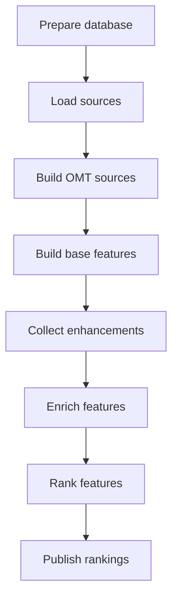

# Map Data Collection, Enhancement, and Ranking

## Purpose

This pipeline prepares geographic data for a MapLibre-based map and calculates the feature-importance rankings used to control map visibility and labeling.

The pipeline:

* Loads OpenStreetMap and external geographic datasets into PostGIS.
* Converts loaded data into the project’s OpenMapTiles-compatible database design.
* Supports custom OMT-compatible geology and fault sources.
* Builds model-feature datasets for ranking.
* Collects external enrichment data.
* Calculates category-specific importance ranks.
* Publishes the resulting ranks back to PostGIS.

The resulting database is served through Martin and consumed by Maputnik and MapLibre GL JS styles.

## Goals

The pipeline shall:

1. Support OSM PBF, vector, and geographic CSV sources through one consistent workflow.
2. Load each source into PostGIS before ranking operations begin.
3. Ensure that every Martin-facing table or materialized view follows the project’s OMT-compatible design.
4. Avoid repeatedly reading or traversing large source datasets.
5. Produce a consistent model-feature dataset regardless of the original source format.
6. Support different model features, enrichments, and ranking models for each map category.
7. Keep expensive operations independently cacheable through precise LiteBuild dependencies.
8. Ensure that every Martin access function receives the rank produced by its corresponding ranking category.
9. Support additional regions, categories, and source types without redesigning the workflow.
10. Provide clear, region- and category-specific artifacts for managing a large pipeline.

## Non-goals

The pipeline does not:

* Render raster or vector map tiles directly.
* Define the final MapLibre visual style.
* Require every category to use the same enrichment sources.
* Require every category to use the same ranking model.
* Force unrelated source datasets into one physical database table.
* Require external datasets to use OSM identifiers.
* Replace existing enrichment and ranking tools as part of the initial redesign.

## Terminology

### Geographic entity

A real-world item processed and potentially displayed by the map, such as a peak, fault, geyser, waterfall, volcanic field, or named place.

### Source record

A record from an original source dataset.

Several source records may represent one geographic entity. For example, multiple fault segments may belong to one named fault.

### Database record

A row stored in a PostGIS table or materialized view.

### Model feature

An attribute used by the WLM or RFR ranking system, such as elevation, prominence, article length, population, or category score.

### Base-feature CSV

A model input dataset containing one row per geographic entity and columns containing database-derived model features.

The word “feature” in this artifact name refers primarily to model features rather than geographic entities.

### Rank

The final display-priority value assigned to a geographic entity and consumed by its Martin access function.

## Database Model

All Martin-facing tables and materialized views follow the project’s OMT-compatible database design.

This includes:

* Standard OSM-derived map tables.
* Custom geology tables.
* Custom fault tables.
* Tables or materialized views created from external vector or CSV sources.

An OMT-facing entity set provides, as applicable:

* Stable identifier.
* Geometry.
* Name.
* Short or alternate name.
* Class.
* Subclass.
* Rank.
* Other attributes required by Martin or the MapLibre style.

External source or staging tables may retain their original structure. They are converted into an OMT-compatible table or materialized view before they are accessed by Martin or the ranking pipeline.

PostGIS is the boundary between source ingestion and downstream processing. Once data has been loaded and converted into its OMT-facing form, later stages do not need to know whether it originally came from OSM, a Shapefile, a GeoPackage, or a CSV.

## Regions and Categories

Processing is organized by region and ranking category.

### Region

A region identifies the geographic dataset being processed.

The initial region is:

```text
uswest
```

Additional regions of approximately similar scale are expected later.

Preparing a region may involve substantial source acquisition, OSM ingestion, and database processing. Region-level outputs must therefore be reusable by every applicable category in that region.

### Ranking category

A ranking category corresponds to one Martin access function and one independent rank domain.

The canonical ranking categories are:

* `fault`
* `geological`
* `geyser`
* `peak`
* `placenames`
* `volcanic`
* `waterfall`

These names must be used consistently in:

* LiteBuild profiles.
* Configuration files.
* Intermediate filenames.
* Model outputs.
* Rank-publication configuration.
* Martin access-function mappings.

Each Martin access function consumes the rank generated by its matching category. Categories must remain separate even when they read from the same database table.

### Profiles

The standard LiteBuild profile name is:

```text
{region}_{category}
```

Examples include:

```text
uswest_fault
uswest_geological
uswest_geyser
uswest_peak
uswest_placenames
uswest_volcanic
uswest_waterfall
```

A region profile group runs every required category:

```text
all_uswest
```

Shared region-level work, such as loading the regional OSM PBF, must run only once.

## Source Types

The initial source types are:

### OpenStreetMap

Regional OSM data is supplied as an OSM PBF and loaded with osm2pgsql using the project’s flex configuration.

The OSM source is loaded once per region and shared by the applicable ranking categories.

### External vector data

External vector data may be supplied as:

* Shapefiles.
* GeoPackages.
* GeoJSON.
* Other GDAL-supported vector formats.

USGS fault data is an example.

External vector data commonly requires an additional materialization stage to aggregate, normalize, or simplify source records into the OMT-facing entity set.

### Geographic CSV data

CSV files may supply geographic entities with coordinate columns.

The volcanic-field node dataset is an example.

The loader validates the coordinates, constructs PostGIS point geometry, and preserves the configured source attributes.

## Workflow Principles

LiteBuild orchestrates the pipeline.

Each workflow step must:

* Declare every dependency that can affect its result.
* Have exactly one primary output.
* Run only when its output is missing or older than a dependency.
* Produce its primary output only after successful completion.
* Avoid depending on unrelated configuration files.
* Return a nonzero status when processing or validation fails.
* Leave its output stale when it fails.

Database-writing steps use marker files as their primary outputs. A marker certifies that the corresponding database operation completed successfully for its declared inputs.

The workflow remains fixed and declarative. A step that is not required for a profile may use the established touch-only behavior to produce its expected no-op output.

Slow operations must have narrowly targeted dependencies. Changing a ranking model, Wikipedia rule, name-cleanup rule, or materialized-view definition must not cause the regional OSM PBF to be reloaded.

## Artifact Naming

Every primary output identifies its region or its region and category.

Region-level artifacts use:

```text
{region}_{artifact}.{extension}
```

Category-level artifacts use:

```text
{region}_{category}_{artifact}.{extension}
```

Examples include:

```text
uswest_osm.loaded
uswest_fault_source.loaded
uswest_fault_omt.materialized
uswest_fault_base_features.csv
uswest_fault_wikipedia_enrich.csv
uswest_fault_features.csv
uswest_fault_score.csv
uswest_fault_tiers.csv
uswest_fault_rank.updated
```

Generic primary-output names such as `output.csv` or `database.updated` are not permitted.

Consistent artifact naming helps LiteBuild:

* Determine staleness correctly.
* Reuse shared regional outputs.
* Keep categories independent.
* Identify the source of failures.
* Manage a large dependency graph.
* Prevent profiles from accidentally sharing outputs.

## High-Level Workflow

### 1. Prepare Database

Create or update the database structures required by the pipeline and map-serving stack.

This includes:

* PostgreSQL and PostGIS schemas.
* Required tables and columns.
* OMT-compatible database structures.
* Supporting functions.
* Spatial and attribute indexes.
* Martin vector-tile access functions.

This stage remains unchanged and is outside the initial redesign.

Materialized views that depend on loaded source data are constructed in the Build OMT Sources stage.

### 2. Load Sources

Load each configured source into PostGIS using the appropriate adapter.

Initial adapters include:

* OSM PBF loading through osm2pgsql.
* Vector loading through GDAL/OGR.
* Geographic CSV loading with point-geometry construction.

Each independently changeable source is a separate loading unit with its own LiteBuild marker.

Source loading must:

* Validate source files.
* Preserve or create stable identifiers.
* Normalize field types and geometry.
* Reproject geometry when required.
* Respect source and region ownership boundaries.
* Create source-table indexes.
* Validate the loaded result.
* Update its marker only after successful completion.

The regional OSM source is shared by multiple categories. External sources are generally category-specific.

### 3. Build OMT Sources

Convert loaded external source data into the OMT-compatible table or materialized view used by Martin and ranking.

This stage may:

* Apply configured name cleanup.
* Assign or normalize class and subclass.
* Group multiple source records into one geographic entity.
* Merge or simplify geometry.
* Select canonical names.
* Produce one record per ranked entity.
* Create or refresh materialized views.
* Create required indexes.
* Validate the completed OMT-facing entity set.

Name cleanup uses the existing configuration-driven pattern-and-replacement tool. It runs after source loading and before materialization.

Changing name-cleanup configuration or a materialized-view definition rebuilds the OMT-facing source without reloading the original source dataset.

For example:

```text
USGS fault source
    → fault source table
    → name cleanup
    → faults materialized view
```

OSM data that is already in its required OMT-compatible form passes through this stage without being reloaded.

### 4. Build Base Features

Query the category’s OMT-facing table or materialized view and create its base-feature CSV.

This stage reads PostGIS rather than traversing the OSM PBF or external source files again.

The output contains one row per geographic entity and includes:

* Stable entity identifier.
* Name.
* Class, where applicable.
* Subclass, where applicable.
* Latitude.
* Longitude.
* Database-derived model features.

Latitude and longitude are mandatory because Wikipedia article validation and enrichment require them.

Coordinates are derived from the entity geometry:

* Point entities use their point geometry.
* Lines, polygons, and multipart entities use a configured representative-point policy.
* Coordinates are transformed to WGS 84 before export.

A category may choose not to use location as Wikipedia validation evidence, but the coordinates remain present in the base-feature CSV.

The OMT model keeps selection simple. The category configuration identifies:

* OMT-facing table or materialized view.
* Entity identifier.
* Geometry column.
* Name column.
* Class and subclass columns.
* Required model-feature columns.
* Any simple class or subclass restrictions.

Complex joins, aggregation, geometry merging, and deduplication belong in the preceding materialization stage.

The entity set used to produce the base-feature CSV must correspond to the entity set served by the matching Martin access function.

For faults:

```text
fault source records
    → faults materialized view
    → uswest_fault_base_features.csv
    → fault rank
    → faults.rank
    → Martin fault access function
```

### 5. Collect Enhancements

Collect optional external or derived attributes for the base geographic entities.

Current enhancement providers include:

* Wikipedia and Wikidata metadata.
* Topographic prominence.

Enhancement requirements vary by ranking category.

Each provider writes a separate category-scoped enrichment artifact keyed by the category’s stable entity identifier.

This stage remains unchanged and is outside the initial redesign.

### 6. Enrich Features

Join the configured enrichment datasets to the base-feature CSV.

The result contains the complete set of model features required by the category’s WLM or RFR ranking system.

The category feature configuration defines:

* Identifier column.
* Enrichment files.
* Imported model-feature columns.
* Merge policies.
* Missing-value behavior.

This stage remains unchanged and is outside the initial redesign.

### 7. Rank Features

Calculate importance scores and final map ranks.

Ranking is category-specific and may include:

* A trained WLM or RFR model.
* Configured model features.
* Rule-based adjustments.
* Geographic tier assignment.
* Spatial-separation rules.

Each canonical category produces the rank consumed by its corresponding Martin access function.

This stage remains unchanged and is outside the initial redesign.

### 8. Publish Rankings

Write final ranks back to the appropriate PostGIS table.

Publication configuration identifies:

* Ranked entity identifier.
* Target table.
* Target identifier column.
* Target rank column.

The updated rank column must be the one read by the category’s Martin access function.

A ranked entity may update multiple physical records when several records share the same entity identifier. For example, one fault rank may be applied to several fault segments, while the OMT-facing materialized view exposes one row for the named fault.

Only minor configuration changes are expected in this stage.

## Data Flow



## Source-to-Ranking Boundary

The primary architectural boundary is PostGIS:

```text
Source-specific processing
    → OMT-compatible PostGIS entity set
    → source-independent ranking pipeline
```

This provides several benefits:

* OSM PBFs are not traversed twice.
* External datasets use the same downstream ranking workflow as OSM.
* Martin and ranking operate on the same canonical entities.
* Source-specific cleanup and aggregation remain isolated.
* Expensive source loading is not repeated when downstream configuration changes.
* Additional source formats can be added without modifying enrichment or ranking.

## Principal Data Contracts

| Output                              | Scope                          | Purpose                                                |
| ----------------------------------- | ------------------------------ | ------------------------------------------------------ |
| Database-preparation marker         | Database                       | Certifies that required database structures exist      |
| Source-load marker                  | Region and source              | Certifies that source records were loaded successfully |
| OMT-ready or materialization marker | Region and category            | Certifies that the Martin-facing entity set is current |
| Base-feature CSV                    | Region and category            | Contains one entity per row and initial model features |
| Enrichment dataset                  | Region, category, and provider | Contains external or derived model features            |
| Enriched feature CSV                | Region and category            | Contains the complete ranking input                    |
| Ranked output                       | Region and category            | Contains model scores and final ranks                  |
| Rank-publication marker             | Region and category            | Certifies that ranks were written to PostGIS           |

## Initial Redesign Scope

The initial implementation focuses on:

1. Loading OSM, vector, and geographic CSV sources.
2. Applying optional name cleanup to external sources.
3. Creating or refreshing OMT-compatible materialized views.
4. Generating base-feature CSV files directly from PostGIS.
5. Deriving mandatory latitude and longitude from database geometry.
6. Aligning category names and entity populations with Martin access functions.
7. Establishing consistent LiteBuild dependencies and artifact names.

Enhancement collection, feature enrichment, model ranking, and rank publication remain substantially unchanged.

## Attribution

The vector-tile schema used by this product is derived from the OpenMapTiles schema. Any map or product using this schema must display:

```text
© OpenMapTiles
```

If the map or product includes OpenStreetMap data, it must also display:

```text
© OpenStreetMap contributors
```

The combined attribution should appear as:

```text
© OpenMapTiles © OpenStreetMap contributors
```

Attribution must be visible and readable on or near the map. For interactive maps, each attribution should link to its respective project:

* [OpenMapTiles](https://openmaptiles.org/)
* [OpenStreetMap copyright and license](https://www.openstreetmap.org/copyright)

Additional source datasets may have their own attribution requirements, which must also be preserved.
